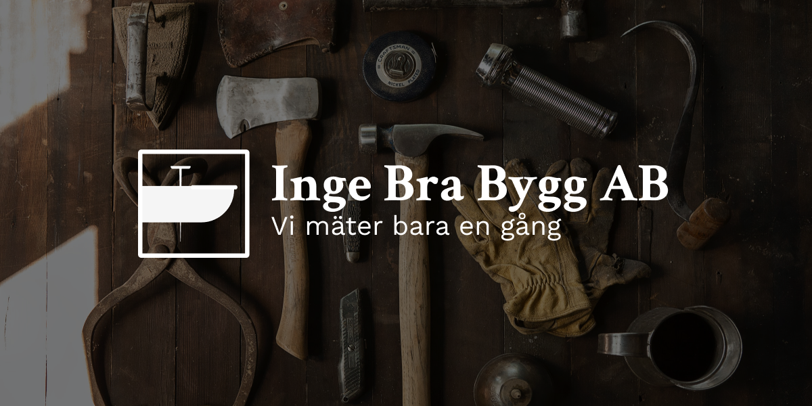

# Inge Bra Bygg AB
**Ärende och kommunikationsplattform mellan byggare och kunder för byggfirman Inge Bra Bygg AB.**

## Bakgrund
Inge Berglund driver en byggfirma som renoverar fasader för privatpersoner och företag. Firman har vuxit en del på senaste tiden och nu vill Inge göra det enklare för hans anställda och kunder att kommunicera kring arbetet som utförs. För att Inge Bra Bygg ska kunna växa så har Inge beställt en del av av en applikation som ska ta hand om all data och användare. Denna del ska vara en webbtjänst som i framtiden förhoppnings kommer bli en del av en större infrastruktur.

## Instruktioner
Läs noga igenom hela projektbeskrivningen.

### För att komma igång
**Problemanalys**, vilka delproblem finns det?

- Sätt upp en Trello
- Planera in möten och hur dessa möten ska gå till
- Skissa på datamodellen med ER-diagram, vilka entiteter och relationer finns det?
- Sätt upp utvecklingsmiljön (skapa repo, initiera node-projekt, boilerplating, etc)
- Sätt upp databasen och ett seed-script
- Skissa på Models och Controllers, vilka behöver du?

### Specifikation
Webbtjänsten ska ta emot och svara med ```JSON```.

#### Resurser

|Resurs|Path|Beskrivning|
|---|---|---|
|Användare|/users|Tre *roller*, *admin*, *worker* och *client*. (Notera att det inte ska finnas ett anonymt läge). Se **roller** för mer detaljer.|
|Ärenden|/tasks|Ärenden ska ha datum när ärendet skapades, datum när den ändrades och om ärendet är avklarat.|
|Meddelanden|/tasks/:id/messages|Meddelanden ska knytas till ett ärende.|
|Bilder|/tasks/:id/images|Till varje ärende ska en bild kunna laddas upp.|


#### Roller

|Roll|Beskrivning|
|---|---|
|admin|Admin ska kunna skapa nya konton och kunna radera resurser.|
|worker|Arbetare ( worker ) ska kunna skapa ärenden kopplade till kunder, skriva meddelanden på ärenden, ladda upp en bild kopplat till ärendet och markera ärenden som klart.|
|client|Kunder (client) ska kunna se sina ärenden och skriva meddelanden på sina ärenden.|


### Tekniker
- Node.js
- Express.js
- Mongoose eller Sequelize
- MVC
- Filuppladdning
- JWT
- Bcrypt
- RBAC
- Websockets (VG)

### Chat feature (VG)
Eftersom ni inte ska bygga en klient så behöver ni inte bygga själva chat-klienten.
Endpointsen för meddelanden ska även uppdatera anslutna websockets att ett nytt meddelande har skickats.

Det kan vara klokt att bygga en liten avskalad klient bara för att testa, men den behöver inte vara med i slutprodukten.

## Bedömning
### För godkänt
- Tydlig namngivning och god kodstruktur
- Samtliga tekniker nyttjade från rubriken “Tekniker”
- Nästan fullt fungerande endpoints
- Någorlunda säkra endpoints och duglig authorization för samtliga endpoints
- Hemligheter i miljövariabler

### För väl godkänt
- {...För godkänt}
- Fullt fungerande endpoints
- Inga konstiga svar från servern (Såsom javascript eller SQL-errors)
- Säkra endpoints och välmotiverad authorization för samtliga endpoints
- Custom Error handling and messaging
- Chat Feature
